# IoT System Design Methodology — Documentation Generation Guide

> **What this file is.** A reusable, detailed methodology that you paste into
> an LLM (Claude) as context, together with a short instruction like:
> *"Using the methodology and the reference system in this file, generate the
> `<Step N>` document for my project."*
>
> It is written so the model can produce **structured documents with rendered
> diagrams and concrete content**, not vague prose. Every step below specifies
> the **purpose**, the **artifacts to produce**, the **diagram(s)** (with ready
> Mermaid templates), **tables/templates**, a **quality bar**, a **worked
> example** from a real system, and a **copy-paste prompt**.
>
> The methodology follows the 10-step IoT design process (Bahga & Madisetti,
> *Internet of Things: A Hands-On Approach*) and extends it with Security,
> Testing, Deployment, and Scalability steps.

---

## 0. How to use this file with Claude

### 0.1 Operating instructions (give these to the model verbatim)

```
You are generating formal IoT design documentation. Follow the methodology in
this file. For the step I name:
1. Produce the artifacts listed under "What to produce" for that step.
2. Render every diagram as a fenced ```mermaid code block. If a diagram type is
   awkward in Mermaid, fall back to a fenced ASCII block — never describe a
   diagram in prose only.
3. Fill every template table completely. If a value is unknown, write "TBD —
   <what is needed>" rather than omitting the row.
4. Ground all content in the "Reference System" appendix of this file. Do not
   invent components, topics, or data that contradict it. If something is
   missing from the reference, flag it as an assumption in an "Assumptions" note.
5. Keep terminology consistent across steps: an entity named in the Domain Model
   must keep the same name in the Information Model, Services, and Views.
6. End each generated document with a "Traceability" note linking its elements
   back to the requirements (R1, R2, …) they satisfy.
```

### 0.2 Diagram conventions

| Diagram | Primary notation | Mermaid type |
|---|---|---|
| Process / flow | Flowchart | `flowchart` |
| Interaction / message flow | Sequence | `sequenceDiagram` |
| Domain & Information model | Class / ER | `classDiagram`, `erDiagram` |
| State of a device/entity | State machine | `stateDiagram-v2` |
| Deployment / operational | Node graph | `flowchart` with subgraphs |
| Functional view | Layered block | `flowchart` with subgraphs |

- **Primary:** Mermaid (renders in most Markdown viewers, GitHub, Claude
  artifacts). **Fallback:** ASCII boxes in a fenced block. **Optional:**
  PlantUML if the target renderer supports it.
- Keep one diagram per concept. A reader should grasp it without the surrounding
  text.

### 0.3 Document package (deliverables)

A complete design package contains one document (or one major section) per step:

```
docs/design/
├── 01_purpose_and_requirements.md
├── 02_process_specification.md
├── 03_domain_model.md
├── 04_information_model.md
├── 05_service_specifications.md
├── 06_iot_level_specification.md
├── 07_functional_view.md
├── 08_operational_view.md
├── 09_integration.md
├── 10_application_development.md
├── 11_security_and_privacy.md
├── 12_testing_and_validation.md
├── 13_deployment_and_operations.md
└── 14_scalability_and_roadmap.md
```

### 0.4 Methodology at a glance

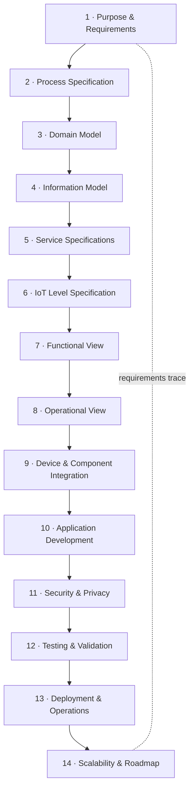

Each step consumes the artifacts of the previous one. Iterate: later steps
routinely expose gaps that send you back to refine requirements or the domain
model.

---

## Step 1 — Purpose & Requirements Specification

**Purpose.** Define *why* the system exists, *what* it must do, and the
constraints it operates under. Everything downstream traces back here.

**Inputs.** Stakeholder goals, problem statement.

**What to produce.**
1. **Purpose statement** — 2–4 sentences: who the users are, the problem, the
   outcome.
2. **Behaviour / use cases** — the things the system does, as numbered UC-n.
3. **Requirements**, each with a stable ID, split into:
   - **Functional (Rf-n)** — observable behaviour.
   - **Non-functional (Rn-n)** — latency, availability, throughput, cost.
   - **System / data / quality / constraints** as further categories.
4. **Assumptions & out-of-scope** list.

**Templates.**

*Requirements table:*

| ID | Type | Requirement | Rationale | Priority (M/S/C/W) | Verify by |
|----|------|-------------|-----------|--------------------|-----------|
| Rf-1 | Functional | … | … | Must | Test T-… |
| Rn-1 | Non-functional | p95 response ≤ 3 s | UX | Must | Load test |

*Use case table:*

| UC | Actor | Trigger | Main flow (1→n) | Result |
|----|-------|---------|-----------------|--------|

**Diagram — use case overview:**

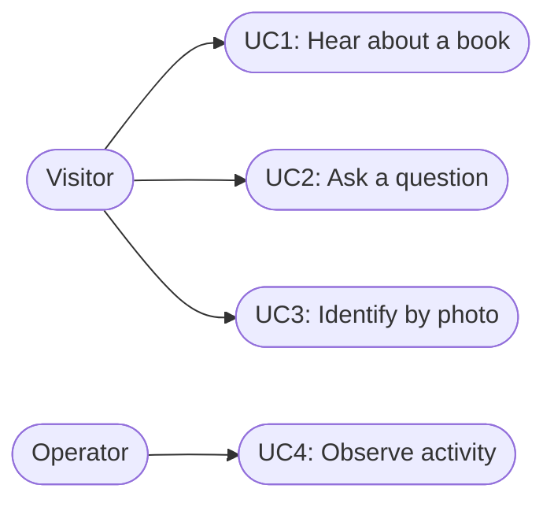

**Quality bar.** Every requirement is *testable* and *atomic* (one obligation
each). No requirement says "fast" without a number.

**Worked example (Reference System).**
- *Purpose:* A self-guided museum/library tour. A visitor carries a small device
  that recognises which exhibit they are standing near and narrates it, answers
  spoken questions about it, and describes photos they take.
- *Rf-1:* When the device detects a known beacon, the system SHALL narrate that
  exhibit within 3 s. *Rf-2:* The system SHALL answer a spoken question using
  only the curated knowledge for the current exhibit. *Rn-1:* p95 end-to-end
  response ≤ 3 s on Wi-Fi. *Rn-3:* The device SHALL degrade gracefully (offline
  cache) when the broker is unreachable.

**Prompt to Claude.**
```
Generate Step 1 (Purpose & Requirements) for my project using the Reference
System appendix. Produce: purpose statement, a use-case table + use-case diagram,
and a requirements table with IDs (Rf-/Rn-), priorities (MoSCoW), and a "verify
by" column. List assumptions and out-of-scope items. Keep every requirement
atomic and testable.
```

---

## Step 2 — Process Specification

**Purpose.** Describe the *processes* (use-case flows) as control/data flow:
the sequence of actions, decisions, and outputs that realise each use case.

**Inputs.** Use cases and functional requirements from Step 1.

**What to produce.**
1. One **process model** per primary use case (flowchart with decisions).
2. A short narrative per process referencing the requirement IDs it satisfies.
3. Error / alternate paths (timeouts, unknown input, rate limits).

**Diagram — process flowchart (template):**

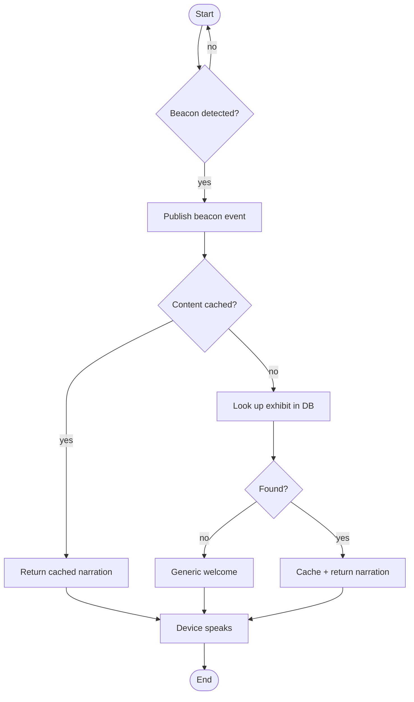

**Diagram — interaction (sequence), for multi-component processes:**

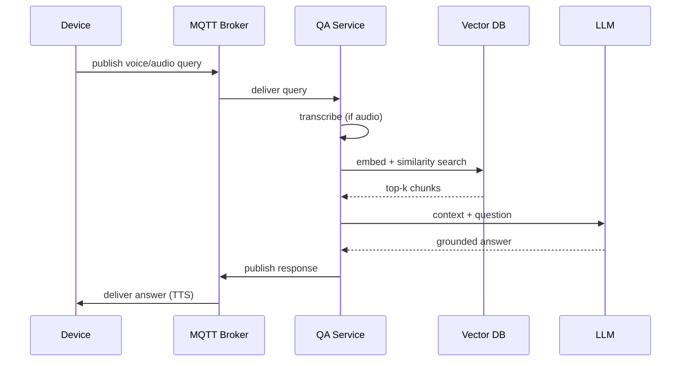

**Quality bar.** Every decision node has both branches resolved; every process
ends in a defined output (including the failure outputs). Each process lists the
Rf-/Rn- IDs it implements.

**Worked example.** Processes: P1 *Proximity narration*, P2 *Q&A (text/audio)*,
P3 *Visual description*, P4 *Operator observation*. P2's audio path adds a
server-side transcription step before retrieval.

**Prompt to Claude.**
```
Generate Step 2 (Process Specification). For each use case from Step 1, produce a
Mermaid flowchart including error/alternate paths (timeout, unknown beacon, rate
limit) and, where multiple components interact, a sequence diagram. Add a one-
paragraph narrative per process citing the requirement IDs it satisfies.
```

---

## Step 3 — Domain Model Specification

**Purpose.** Identify the entities of the problem domain and their relationships,
independent of technology. Uses the IoT domain vocabulary.

**Core concepts to instantiate (define each, then list project instances):**

| Concept | Meaning | Example (Reference System) |
|---|---|---|
| **Physical Entity** | Real-world thing of interest | Exhibit/Book; Visitor |
| **Virtual Entity** | Digital representation of a physical entity | Exhibit record; Session |
| **Device** | Hardware mediating between physical & virtual | Pi tour device; BLE beacon |
| **Resource** | Software component on/for a device (sensor/actuator/storage) | Camera, microphone, BLE scanner, speaker, local cache |
| **Service** | Exposes functionality over the network | Beacon, QA, Vision services |

**Diagram — domain model (class diagram):**

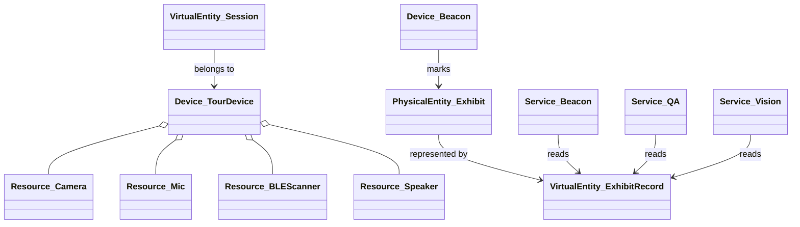

**Quality bar.** Every Device lists its Resources; every Service maps to one or
more Virtual Entities; names here are reused verbatim in all later steps.

**Prompt to Claude.**
```
Generate Step 3 (Domain Model). Define Physical Entities, Virtual Entities,
Devices, Resources, and Services for my project, then a Mermaid classDiagram
showing their relationships (composition for device↔resource, association for
service↔virtual entity). Use names consistently with later steps.
```

---

## Step 4 — Information Model Specification

**Purpose.** Define the *structure* of the virtual entities: attributes, data
types, and relationships — without yet choosing storage technology.

**What to produce.**
1. Attribute tables for each Virtual Entity (name, type, unit, constraints).
2. An **ER / class diagram** of relationships and cardinalities.
3. State models for entities with a lifecycle (e.g., Session).

**Template — attribute table:**

| Entity | Attribute | Type | Unit/Format | Constraints | Notes |
|---|---|---|---|---|---|

**Diagram — entity relationships (ER):**

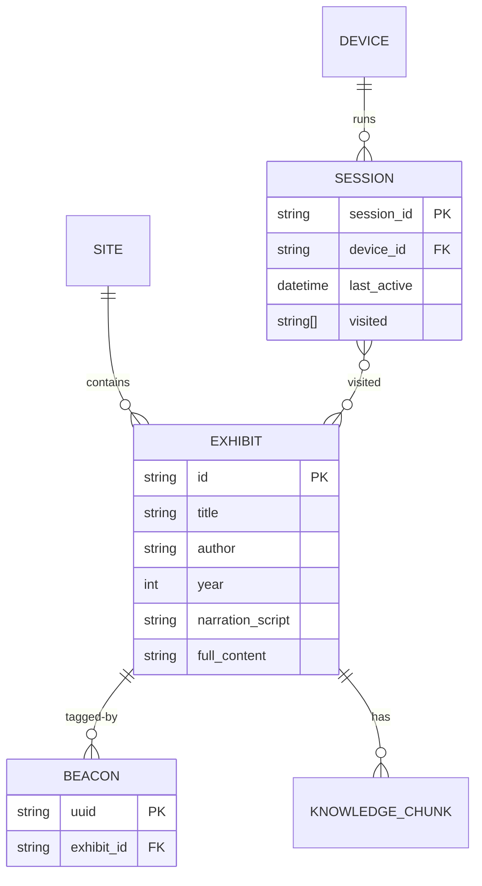

**Diagram — entity state model (template):**

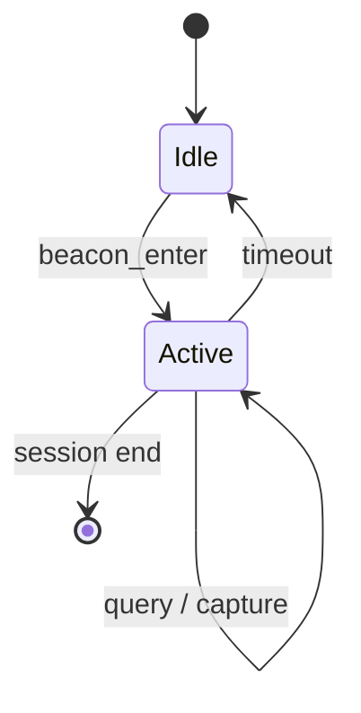

**Quality bar.** Types and units are explicit; every relationship has a
cardinality; keys (PK/FK) are marked. Attributes trace to data appearing in
Service inputs/outputs (Step 5).

**Prompt to Claude.**
```
Generate Step 4 (Information Model). For each Virtual Entity from Step 3, produce
an attribute table (name, type, unit/format, constraints). Add a Mermaid
erDiagram with cardinalities and PK/FK markers, and a stateDiagram for any entity
with a lifecycle (e.g., Session).
```

---

## Step 5 — Service Specifications

**Purpose.** Define the services that operate on the model: what each one does,
its trigger, inputs, outputs, the data it touches, and its interface (here,
MQTT topics + message schemas).

**What to produce, per service:**
1. Responsibility (1 line) and the requirements it satisfies.
2. **Interface table:** trigger topic(s), output topic(s), QoS, retained?
3. **Message schemas** (JSON) for inputs and outputs.
4. **Sequence diagram** of its happy path + key failure path.
5. Dependencies (DBs, models, other services).

**Template — service interface table:**

| Service | Subscribes (in) | Publishes (out) | QoS | Reads/Writes | Satisfies |
|---|---|---|---|---|---|

**Template — message schema:**
```jsonc
// Topic: <namespace>/<scope>/device/<device_id>/<verb>
{
  "device_id": "string",
  "site_id":   "string",
  "session_id":"string",
  "timestamp": "ISO-8601",
  "event":     "string",
  "...":       "payload fields"
}
```

**Diagram — service sequence (template):** see Step 2 sequence template; produce
one per service.

**Quality bar.** Every input field has a type; every service lists both success
and at least one failure output; topic names match the Operational/Integration
steps exactly.

**Worked example (Reference System topics).**

| Service | Subscribes | Publishes | Notes |
|---|---|---|---|
| Beacon | `…/device/+/cmd` (event=`beacon_enter`) | `…/device/{id}/response`, `…/beacon/{uuid}/content` (retained) | DB lookup + cache |
| QA | `…/device/+/voice`, `…/device/+/audio` | `…/device/{id}/response` | STT + RAG + LLM |
| Vision | `…/device/+/cam` | `…/device/{id}/response` | image → LLM description |

**Prompt to Claude.**
```
Generate Step 5 (Service Specifications). For each service in the Reference
System, produce: a responsibility line, an interface table (subscribe/publish
topics, QoS, retained, data touched, requirements satisfied), JSON message
schemas for inputs and outputs, and a Mermaid sequence diagram of the happy path
plus one failure path.
```

---

## Step 6 — IoT Level Specification

**Purpose.** Classify the deployment topology against the standard IoT levels
(1–5) and justify the choice against the non-functional requirements.

**Reference — the five levels:**

| Level | Sensing/Analysis/Storage location | Fits when |
|---|---|---|
| 1 | Everything on the device, local | Low data, low compute, single node |
| 2 | Device does sensing/actuation; **analysis in cloud**; local storage | Bigger data, simple control |
| 3 | Device sensing; **cloud analysis + cloud storage** | Heavy storage/compute, single sensor stream |
| 4 | **Multiple devices**, cloud analysis/storage, local + cloud observers | Many distributed nodes |
| 5 | Multiple end nodes + **coordinator/gateway**; cloud analysis/storage | Mesh/coordinator topologies |

**Diagram — chosen level (template):**

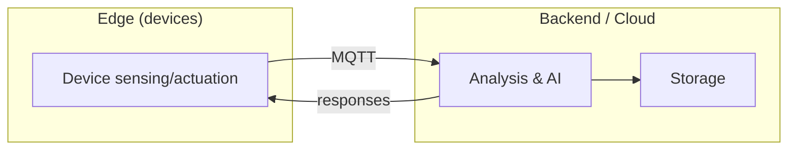

**Quality bar.** State the level explicitly, map each requirement (esp.
storage/compute/scale) to why that level is correct, and note what would push it
to the next level.

**Worked example.** The Reference System is **Level 4**: multiple tour devices,
all analysis (STT, RAG, vision, LLM) and storage (relational + vector + cache)
in the backend, plus a separate observer (the operator dashboard).

**Prompt to Claude.**
```
Generate Step 6 (IoT Level Specification). Identify the IoT level (1–5) for my
project, justify it against the non-functional requirements (storage, compute,
number of nodes), draw the level topology in Mermaid, and state what change would
move it to the next level.
```

---

## Step 7 — Functional View Specification

**Purpose.** Group capabilities into the standard **Functional Groups (FGs)**
and define what each contains. This is technology-aware but not yet a
deployment.

**The six functional groups (define each, list project functions):**

| FG | Contains |
|---|---|
| **Device** | Sensors, actuators, on-device firmware/agent |
| **Communication** | Protocols, message bus, addressing |
| **Services** | The application services (Step 5) |
| **Management** | Provisioning, configuration, monitoring, health |
| **Security** | AuthN/Z, encryption, key management, privacy |
| **Application** | UIs, dashboards, operator/visitor-facing apps |

**Diagram — functional view (layered):**

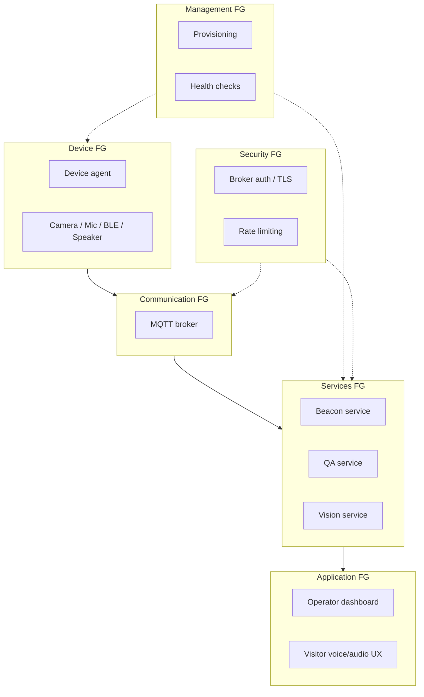

**Quality bar.** Every Service from Step 5 appears in the Services FG; every
Device/Resource from Step 3 appears in the Device FG; nothing is unassigned.

**Prompt to Claude.**
```
Generate Step 7 (Functional View). Assign every component to one of the six
functional groups (Device, Communication, Services, Management, Security,
Application), list the functions in each, and draw a layered Mermaid diagram.
Ensure every Step 3 device/resource and Step 5 service is placed.
```

---

## Step 8 — Operational View Specification

**Purpose.** Map the functional view onto **concrete deployment choices**:
hosts, processes, protocols, runtimes, hosting, and where each component runs.

**What to produce.**
1. **Deployment table:** component → host/runtime → how it's started → ports.
2. **Deployment diagram** (nodes + processes + protocols).
3. Options chosen per operational concern (below).

**Template — operational concerns table:**

| Concern | Option chosen | Notes |
|---|---|---|
| Devices & components | … | |
| Communication APIs/protocols | … | |
| Service hosting & runtime | … | |
| Data storage | … | |
| Analytics / AI | … | |
| Application hosting | … | |
| Provisioning & deployment | … | |
| Monitoring | … | |

**Diagram — deployment (template):**

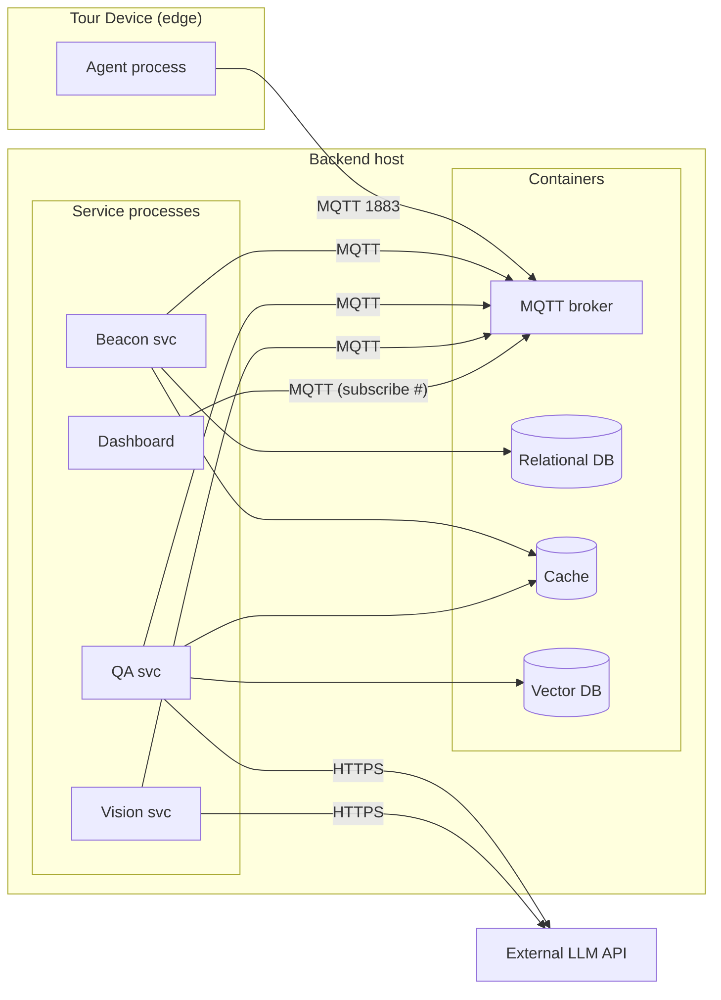

**Quality bar.** Every Service/DB names a host, a runtime, and a start mechanism;
all protocols and ports are labelled; matches Step 5 topics and Step 9 wiring.

**Worked example (Reference System).** Backend host runs infrastructure
(broker, relational DB, cache, vector DB) as containers and the application
services + dashboard as long-running Python processes; tour devices run the agent
at the edge; the LLM is an external API. (See Reference appendix for specifics.)

**Prompt to Claude.**
```
Generate Step 8 (Operational View). Produce a deployment table (component → host
→ runtime → start mechanism → port), fill the operational concerns table, and
draw a Mermaid deployment diagram with protocols and ports labelled. Keep hosts
and topics consistent with Steps 5 and 9.
```

---

## Step 9 — Device & Component Integration

**Purpose.** Specify how the pieces are physically/logically wired together: how
devices connect to the bus, how services bind to topics, how data stores are
reached, and the configuration/secrets each needs.

**What to produce.**
1. **Integration matrix:** component A ↔ component B, via protocol, with config
   keys and credentials.
2. **Connection/config table:** each component's required env/config and
   defaults.
3. **Wiring diagram** (who connects to what).
4. Integration sequence for **bring-up order** (what must be ready first).

**Template — integration matrix:**

| From | To | Protocol/Port | Auth | Config keys | Notes |
|---|---|---|---|---|---|

**Diagram — bring-up order (template):**

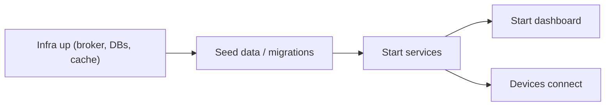

**Quality bar.** Every connection lists protocol, auth, and the exact config
keys; secrets are referenced (not hard-coded); bring-up dependencies are
explicit (e.g., DB healthy before service starts).

**Prompt to Claude.**
```
Generate Step 9 (Device & Component Integration). Produce an integration matrix
(from/to/protocol/port/auth/config keys), a per-component configuration table
with env vars and defaults, a Mermaid wiring diagram, and a bring-up order
diagram. Reference secrets by name; never inline credentials.
```

---

## Step 10 — Application Development

**Purpose.** Specify the software that turns the integrated system into a usable
product: the device agent, the services' internal design, and the user/operator
applications. This is where you map design to code modules.

**What to produce.**
1. **Module map:** each runnable (agent, each service, dashboard) → its
   responsibilities, key modules/classes, and external libraries.
2. **Component diagram** of internal structure for the non-trivial runnables.
3. **API/UX spec** for any application surface (endpoints, screens, events).
4. **Pseudocode or class outline** for the central control loop(s).
5. Mapping from modules back to Services (Step 5) and Requirements (Step 1).

**Template — module map:**

| Runnable | Module/Class | Responsibility | Key libs | Implements |
|---|---|---|---|---|

**Diagram — component structure (template):**

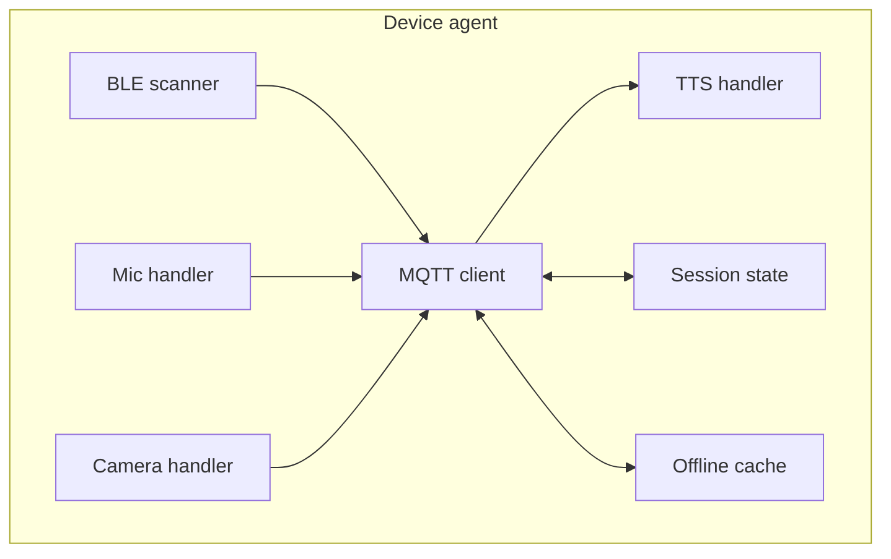

**Diagram — application (dashboard) events (template):**

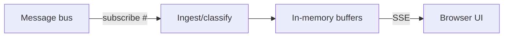

**Quality bar.** Every runnable has a module map; the central loop has
pseudocode; each module cites the Service/Requirement it implements; library
choices are named.

**Prompt to Claude.**
```
Generate Step 10 (Application Development). For each runnable (device agent, each
service, dashboard), produce a module map (module → responsibility → libs →
implements), a Mermaid component diagram, an API/UX spec for application
surfaces, and pseudocode for the main control loop. Map modules back to Step 5
services and Step 1 requirements.
```

---

## Step 11 — Security & Privacy Specification *(extension)*

**Purpose.** Specify the threat model and the controls across the stack.

**What to produce.**
1. **Asset list** (data, credentials, devices) and **trust boundaries**.
2. **Threat table** (STRIDE per boundary) with mitigations.
3. **Control matrix:** transport security, broker authN/Z & ACLs, secret
   management, rate limiting/abuse, PII handling & retention.
4. Data-flow diagram annotated with trust boundaries.

**Template — threat table:**

| Boundary | Threat (STRIDE) | Impact | Likelihood | Mitigation | Status |
|---|---|---|---|---|---|

**Diagram — trust boundaries:**

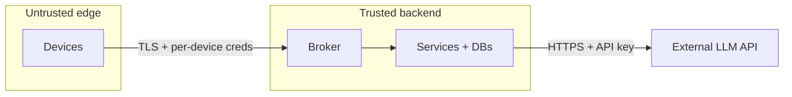

**Prompt to Claude.**
```
Generate Step 11 (Security & Privacy). Produce an asset/trust-boundary list, a
STRIDE threat table with mitigations and status, a control matrix (transport,
broker authN/Z + ACL, secrets, rate limiting, PII retention), and a trust-
boundary data-flow diagram. Flag current gaps vs. target state.
```

---

## Step 12 — Testing & Validation *(extension)*

**Purpose.** Define how each requirement is verified.

**What to produce.**
1. **Traceability matrix:** requirement → test(s) → method.
2. Test levels: unit, integration (per service), end-to-end (per process),
   non-functional (latency, load, soak), failure-injection (broker down, DB
   timeout, rate-limit).
3. A reproducible E2E procedure (how to drive the system without hardware, e.g.
   a device simulator) and expected observations.

**Template — traceability matrix:**

| Requirement | Test ID | Level | Method | Pass criteria |
|---|---|---|---|---|

**Prompt to Claude.**
```
Generate Step 12 (Testing & Validation). Produce a requirement→test traceability
matrix, define unit/integration/E2E/non-functional/failure-injection tests, and
write a reproducible end-to-end test procedure (using a simulator where hardware
isn't available) with expected observations.
```

---

## Step 13 — Deployment & Operations *(extension)*

**Purpose.** Make the system runnable and operable.

**What to produce.**
1. **Environments** (dev/stage/prod) and what differs.
2. **Run procedures:** infra up, migrations/seeding, start services, start
   device agent — in dependency order (reuse Step 9 bring-up).
3. **Observability:** logs, health checks, metrics, the operator dashboard.
4. **Runbooks:** common failures and recovery.

**Diagram — operational runtime:** reuse the Step 8 deployment diagram annotated
with log/health/metric flows.

**Prompt to Claude.**
```
Generate Step 13 (Deployment & Operations). Produce environment definitions, an
ordered run procedure (infra → migrate/seed → services → agent), an observability
plan (logs, health, metrics, dashboard), and runbooks for the top failure modes.
```

---

## Step 14 — Scalability & Roadmap *(extension)*

**Purpose.** Show how the design grows and what changes at scale.

**What to produce.**
1. **Scaling dimensions:** more devices, more sites, more content, more queries.
2. **Bottleneck analysis** per dimension and the mitigation (horizontal service
   scaling, broker clustering, DB read replicas, caching, model/cost limits).
3. **Roadmap** with phased milestones.

**Prompt to Claude.**
```
Generate Step 14 (Scalability & Roadmap). Identify scaling dimensions, analyse
the bottleneck and mitigation for each, and produce a phased roadmap. Note the
IoT-level transition (Step 6) that scale would trigger.
```

---

## Appendix A — Reference System: Museum Tour Automation (ground all generation in this)

> This appendix describes the **actual implemented project** — a self-guided,
> AI-powered museum/library audio-tour system. Values below are taken from the
> real code, config, and database schema; use them verbatim when generating
> documents. The current demo instance is a **book library** (`museum_id =
> demo-library`), but the same platform serves any museum: a museum is just a
> different set of exhibits, beacons, and curated content (see A.13).

### A.0 What the system does (problem & automation)

A museum/library wants to give every visitor a **personal guided tour** without
staffing a human guide per visitor. The automation:

1. **Knows where the visitor is** — BLE beacons attached to each exhibit let a
   handheld device detect, by radio proximity, which exhibit the visitor has
   walked up to.
2. **Narrates automatically** — on arrival the device speaks a curated
   introduction for that exhibit (no button press needed).
3. **Answers questions** — the visitor asks anything aloud; the system
   transcribes the speech, retrieves the relevant curated knowledge for the
   current exhibit, and speaks a grounded answer.
4. **Describes what the camera sees** — the visitor points the device at an
   object/cover/page and gets a spoken description, contextualised to the current
   exhibit.
5. **Degrades gracefully** — if the network/broker is down, the device falls
   back to a local cache of recently seen exhibits.
6. **Is observable** — staff watch a live web dashboard of every beacon hit,
   transcription, generated answer, and captured photo.

The "automation" is the closed loop **proximity → context → AI response →
speech**, with curated content keeping AI answers grounded and on-brand.

### A.1 End-to-end experience (the three core interactions)

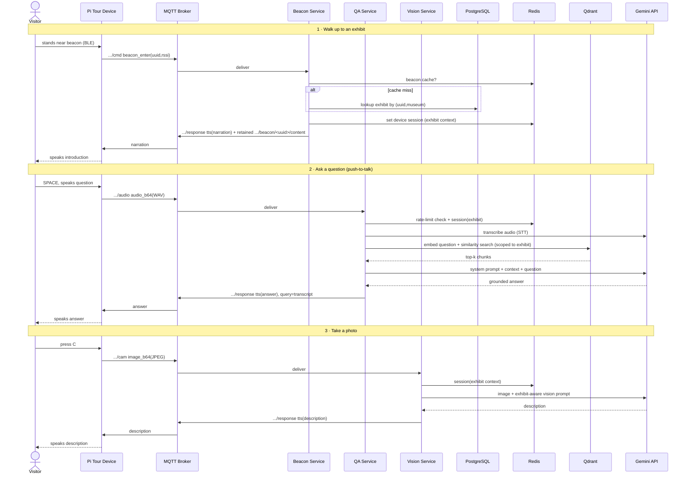

### A.2 Edge device — Raspberry Pi tour agent

A single async **agent** (`device/agent.py`) runs three concurrent tasks — BLE
scan loop, mic push-to-talk loop, and the MQTT network loop — plus camera and TTS
on demand. Components (all under `device/`):

| Module | Role | Key behaviour |
|---|---|---|
| `agent.py` | Orchestrator | Loads config, greets, runs `ble.scan_loop()`, `mic.listen_loop()`, `mqtt.loop_forever()` via `asyncio.gather`; handles SIGINT/SIGTERM. |
| `ble_scanner.py` | Proximity | `bleak` scan every 500 ms; parses iBeacon/Eddystone; picks strongest beacon ≥ threshold; debounces; emits `beacon_enter`. |
| `mic_handler.py` | Voice input | Push-to-talk: **SPACE** records (16 kHz mono WAV), **C** triggers a photo; publishes audio for server-side STT. Needs a TTY. |
| `camera_handler.py` | Vision input | Backend auto-detect: **picamera2** (Pi) → **OpenCV** (webcam) → placeholder; captures JPEG, resizes if over payload cap, base64-encodes. |
| `tts_handler.py` | Voice output | `pyttsx3` (offline) or `gTTS` (online); speaks in a background thread with a lock to avoid overlap; prints `[SPEAK]` if no engine. |
| `mqtt_client.py` | Transport | paho MQTTv5 client `device-<id>`; publishes `cmd/voice/audio/cam`; subscribes `response` + retained `beacon/+/content`; routes responses to TTS; offline fallback on publish failure. |
| `session.py` | State | Dataclass: `session_id` (`sess-<hex>`), current beacon/exhibit, `exhibits_visited`, `is_speaking`. |
| `offline_cache.py` | Resilience | SQLite (`exhibit_cache`) of last N exhibits; 7-day TTL; used when MQTT publish fails. |
| `config.py` / `device_config.yaml` | Config | Per-device YAML (see A.10), generated by provisioning. |

### A.3 BLE proximity detection (the trigger)

- **Library:** `bleak` (`BleakScanner.discover`), cross-platform, async.
- **Beacon formats parsed** (`_extract_beacon_uuid`):
  - **iBeacon** — Apple manufacturer ID `0x004C`, byte `0`=`0x02`, bytes `2..18`
    = the 16-byte proximity UUID, formatted `8-4-4-4-12` lowercase.
  - **Eddystone** — service UUID `0xFEAA`; falls back to the device MAC as a key.
  - **Fallback** — first advertised service UUID, so any BLE peripheral works in
    testing.
- **Selection logic:** each scan collects every beacon with `rssi ≥
  rssi_threshold` (default **−70 dBm ≈ 1–2 m**), picks the **strongest**, and
  emits `beacon_enter` only if it differs from the current active beacon and the
  per-beacon **debounce** (default **2 s**) has elapsed. When no beacon is in
  range, the device calls `session.leave_exhibit()` (a logical `beacon_exit`).
- **Demo beacon UUIDs** are fixed per book (see A.12).

### A.4 Communication — MQTT topic contract

**Broker:** Eclipse Mosquitto 2.0, **MQTTv5**, port **1883** (dev, no TLS; **8883
+ TLS** in prod). Service/account auth via username+password
(`service_account` in dev; password set via `MQTT_SERVICE_PASSWORD`). QoS 1 for events/responses.

**Namespace:** `museum/{museum_id}/...`. Concrete topics:

| Dir | Topic | Event/Type | Payload (beyond the base envelope) |
|---|---|---|---|
| Dev→ | `museum/{m}/device/{d}/cmd` | `beacon_enter` | `beacon_uuid`, `rssi` |
| Dev→ | `museum/{m}/device/{d}/voice` | `voice_query` | `transcript`, `exhibit_id` (text path) |
| Dev→ | `museum/{m}/device/{d}/audio` | `audio_query` | `audio_b64`, `mime_type` (`audio/wav`), `exhibit_id` |
| Dev→ | `museum/{m}/device/{d}/cam` | `camera_capture` | `image_b64` (JPEG), `exhibit_id` |
| →Dev | `museum/{m}/device/{d}/response` | — | `response_type` (`tts`\|`error`), `text`, `exhibit_id`, `query` (echoed transcript), `session_id` |
| →Dev | `museum/{m}/beacon/{uuid}/content` | retained | `exhibit_id`, `title`, `author`, `tts_script` |

**Base envelope** on every device→server message: `device_id`, `museum_id`,
`session_id`, `timestamp` (ISO-8601 UTC). The device subscribes to its own
`.../response` and to `museum/{m}/beacon/+/content` (retained, so it caches
exhibit content the moment it connects).

### A.5 Backend services (server-side, the AI brain)

All three subclass `MQTTSubscriberService` (`services/shared/mqtt_subscriber.py`)
which handles connect/auth/subscribe/reconnect and auto-publishes any returned
dict to `museum/{m}/device/{d}/response`.

**A.5.1 Beacon Content Service** (`services/beacon_service/main.py`)
- Subscribes `museum/+/device/+/cmd`, acts only on `event=beacon_enter`.
- **Redis cache** (`beacon_cache:{museum}:{uuid}`, 1 h TTL) → **Postgres** lookup
  (`beacons ⋈ exhibits` by composite key `(uuid, museum_id)`) on miss.
- Updates the Redis **device session** (`exhibit_id`, `exhibit_title`) so QA and
  Vision know the current context; best-effort **durable history** in
  `device_sessions` (upsert + append to `exhibits_visited`).
- Publishes the exhibit's `tts_script` as the narration **and** a **retained**
  `beacon/{uuid}/content` message. Unknown beacon → friendly generic welcome.

**A.5.2 AI Q&A Service** (`services/qa_service/main.py`) — the RAG pipeline
- Subscribes `museum/+/device/+/voice` (text) and `museum/+/device/+/audio` (raw
  audio). **Per-device rate limit** (Redis `INCR`, **10 queries / 60 s**) checked
  before any LLM spend.
- **Audio path:** server-side **STT** via Gemini native audio input. The STT
  prompt is primed with English, the current exhibit title, and a **vocabulary
  hint** — a `"Title — Author"` list scrolled from Qdrant and cached per museum —
  so proper nouns (e.g. "Sapiens", "Fitzgerald") transcribe correctly.
- **RAG:** embed the question with a **local sentence-transformer**
  (`all-MiniLM-L6-v2`, **384-dim**, cosine); search Qdrant collection
  `{museum_id}_knowledge` **filtered to the current `exhibit_id`** (`TOP_K=3`,
  `SIMILARITY_THRESHOLD=0.35`); if nothing, fall back to a whole-collection
  search; if still nothing, return the curated "ask a librarian" line.
- **Generation:** build a context block from retrieved chunks and call the LLM
  with a strict system prompt ("answer ONLY from the provided context, 2–4
  sentences, warm tour-guide tone, no meta-phrases, no lists"). On a 429/quota
  error it speaks a friendly "busy, try again" message. The response echoes the
  `query` (transcript) so the dashboard can show what was heard.

**A.5.3 Vision Service** (`services/vision_service/main.py`)
- Subscribes `museum/+/device/+/cam`. Resizes the image (longest side ≤ **1024
  px**, JPEG q75) to bound payload/cost.
- Reads the Redis session for exhibit title/author/year, injects it into the
  **vision prompt** ("you are a library guide… describe in 2–3 spoken
  sentences…"), calls the vision-capable LLM, returns a `tts` description.

### A.6 Data stores

**PostgreSQL** (schema in `database/migrations/`):

```mermaid
erDiagram
    museums ||--o{ exhibits : has
    museums ||--o{ beacons : has
    exhibits ||--o{ beacons : tagged-by
    museums {
        text id PK
        text name
        timestamptz created_at
    }
    exhibits {
        text id PK
        text museum_id PK_FK
        text title
        text author
        int year_created
        text genre
        text location
        text tts_script
        text full_content
        jsonb metadata
    }
    beacons {
        text uuid PK
        text museum_id PK_FK
        text exhibit_id FK
        text location
    }
    device_sessions {
        text session_id PK
        text device_id
        text museum_id
        timestamptz started_at
        timestamptz last_active
        text_array exhibits_visited
    }
```

- `exhibits` PK is **composite** `(id, museum_id)`; `beacons` FK is composite →
  `exhibits`. `tts_script` = the spoken intro; `full_content` = long-form
  knowledge chunked into Qdrant.

**Redis** (`services/shared/redis_client.py`):

| Key | Purpose | TTL |
|---|---|---|
| `session:{device_id}` | current exhibit context (read by QA/Vision) | 4 h |
| `beacon_cache:{museum}:{uuid}` | exhibit content fast-path | 1 h |
| `rate_limit:{device_id}:voice` | sliding query counter | 60 s |

**Qdrant:** one collection per museum, **`{museum_id}_knowledge`**, 384-dim
cosine vectors. Each point payload: `exhibit_id`, `museum_id`, `chunk_index`,
`text`, `title`, `author`, `genre`. Ingestion (`scripts/ingest_books.py`) chunks
`full_content` with a `RecursiveCharacterTextSplitter` (**size 512, overlap 64**)
and re-ingest is idempotent (deletes a book's existing chunks first).

### A.7 AI / analytics stack

| Function | Where | Model (dev default) |
|---|---|---|
| Embeddings | Local, on the QA service | `all-MiniLM-L6-v2` (384-dim, no API key) |
| STT (audio→text) | Gemini API | `gemini-2.5-flash-lite` (separate model to split rate-limit buckets) |
| Q&A generation | Gemini API | `gemini-2.5-flash` |
| Vision description | Gemini API | `gemini-2.5-flash` |

`LLM_PROVIDER` is **pluggable** (`gemini` \| `anthropic` \| `openai`); all three
services branch on it. Thinking budget is disabled for flash/flash-lite to
conserve free-tier quota.

### A.8 Operator dashboard (`dashboard/`)

A read-only **Flask** observer: a background paho thread subscribes to
`museum/#`, classifies traffic, keeps in-memory ring buffers (200 events, last 20
images/audio), and streams to the browser via **Server-Sent Events**. The UI
shows four panels — 📷 camera images, 💬 generated text, 🎤 transcriptions
(from `/voice` and the echoed `/response.query`), 📡 BLE activations (beacon →
book title via retained content, with `seed_books.json` fallback) — plus a
combined live feed. Routes: `/` (page), `/events` (SSE), `/api/snapshot`,
`/image/<id>`, `/audio/<id>`. Runs as `nohup python app.py` on port **5005**.

### A.9 Deployment & operations

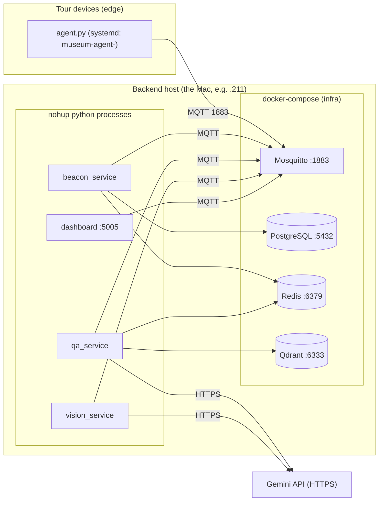

- **Infra** runs in Docker (`docker-compose.yml`); Postgres auto-runs the
  migrations on first start; Qdrant/Redis/Postgres have healthchecks.
- **Services + dashboard** run as long-running Python processes (in production on
  this project, as `nohup` processes on the backend Mac).
- **Devices** run `agent.py`, installed via **systemd**
  (`museum-agent-<device_id>.service`, `Restart=always`, after
  `network-online`+`bluetooth`).
- **Provisioning:** `scripts/provision_device.py --device-id … --broker-host …
  [--install-systemd]` writes a per-device `device_config.yaml` and (optionally)
  the systemd unit.
- **Content load:** `scripts/ingest_books.py` seeds Postgres + Qdrant from
  `data/books/seed_books.json` (re-runnable, `--book-id` for one).
- **Health:** `scripts/health_check.py [--e2e]` checks broker, Postgres (+exhibit
  counts), Redis, Qdrant (+collection/vector counts), and an end-to-end beacon
  round-trip.
- **Config/secrets** via `.env` (broker creds, DB DSN parts, Redis, Qdrant,
  `LLM_PROVIDER`, model names, `GEMINI_API_KEY`). Devices configured via YAML.

### A.10 Device configuration (defaults from `device_config.yaml`)

| Group | Keys (defaults) |
|---|---|
| `mqtt` | `broker_host`, `broker_port 1883`, `use_tls false`, `keepalive 60` |
| `ble` | `scan_interval_ms 500`, `rssi_threshold -70`, `debounce_seconds 2.0`, `beacon_type iBeacon` |
| `audio` | `sample_rate 16000`, `silence_threshold 0.01`, `silence_duration_ms 1500`, `max_clip_seconds 10.0`, `input_device_index 0` |
| `camera` | `resolution [1280,720]`, `jpeg_quality 75`, `max_payload_kb 150` |
| `tts` | `engine pyttsx3`, `rate 150`, `voice_id null` |
| `offline_cache` | `db_path …`, `max_exhibits 50` (7-day entry TTL) |

### A.11 Key non-functional facts (for requirements/testing/scaling)

- **Latency budget:** narration/answer target ≈ within a few seconds; QA does
  STT + embed + vector search + LLM serially.
- **Payload limits:** camera capped at `max_payload_kb` (150 KB) before publish;
  vision re-caps to ≤1024 px server-side.
- **Rate limiting:** 10 voice queries / device / minute (Redis).
- **TTLs:** session 4 h, beacon cache 1 h, offline cache 7 days.
- **Resilience:** retained beacon content + device SQLite cache enable degraded
  operation when the broker is unreachable; services auto-reconnect (1–30 s
  backoff); paho auto-reconnect on the device.
- **IoT level:** **Level 4** — many edge devices, all analysis/storage in the
  backend, separate operator observer.

### A.12 Seed content (demo library, `data/books/seed_books.json`)

| Exhibit id | Title | Author | Beacon UUID |
|---|---|---|---|
| book-001 | Pride and Prejudice | Jane Austen | `550e8400-e29b-41d4-a716-446655440001` |
| book-002 | 1984 | George Orwell | `550e8400-e29b-41d4-a716-446655440002` |
| book-003 | To Kill a Mockingbird | Harper Lee | `550e8400-e29b-41d4-a716-446655440003` |
| book-004 | The Great Gatsby | F. Scott Fitzgerald | `550e8400-e29b-41d4-a716-446655440004` |
| book-005 | Sapiens: A Brief History of Humankind | Yuval Noah Harari | `550e8400-e29b-41d4-a716-446655440005` |

Each book carries `tts_script` (spoken intro) and `full_content` (RAG knowledge).

### A.13 Generalising to a real museum

The platform is exhibit-agnostic; the books demo is one `museum_id`. To serve a
real museum: export exhibit content to the same JSON schema (`id`, `beacon_uuid`,
`title`, `tts_script`, `full_content`, + domain fields in `metadata`), assign
beacon UUIDs to physical beacons, set a real `museum_id`, and run
`ingest_books.py --museum-id <slug>`. The MQTT topology, services, and RAG
pipeline need **zero code changes**.

### A.14 Mapping table (generic methodology term ↔ this project)

| Generic term | This project |
|---|---|
| Site | Museum / library (`museum_id`, e.g. `demo-library`) |
| Exhibit / Physical Entity | Book (or artwork) |
| Beacon | BLE iBeacon tagging an exhibit |
| Tour device | Raspberry Pi running `agent.py` |
| Message bus | MQTT (Mosquitto, v5) |
| Relational / Cache / Vector DB | PostgreSQL / Redis / Qdrant |
| External LLM API | Gemini (`LLM_PROVIDER` pluggable) |
| Local embedder | `all-MiniLM-L6-v2` sentence-transformer |
| Operator app | Flask SSE dashboard (`dashboard/`) |

---

## Appendix B — Mermaid cheat-sheet

```text
flowchart TD|LR        nodes: A[rect]  B(round)  C{decision}  D([stadium])  E[("DB")]
                       edges: A --> B   A -- label --> B   A -. dotted .- B
sequenceDiagram        participant X / actor X ; X->>Y: call ; Y-->>X: return ; Note over X: ...
classDiagram           class Name ; A --> B : assoc ; A o-- B : composition ; A <|-- B : inherits
erDiagram              A ||--o{ B : has   (||=one, o{=zero..many, |{=one..many)
stateDiagram-v2        [*] --> S1 ; S1 --> S2 : event ; S2 --> [*]
subgraph NAME ... end   group nodes into a labelled box
```

Tips: quote labels containing spaces/punctuation `["like this"]`; keep node IDs
short and alphanumeric; one diagram per concept.

---

## Appendix C — Deliverables checklist

- [ ] Step 1 — Purpose + use-case diagram + requirements table (IDs, MoSCoW, verify-by)
- [ ] Step 2 — Process flowcharts (+ sequence diagrams) incl. error paths
- [ ] Step 3 — Domain model class diagram (entities/devices/resources/services)
- [ ] Step 4 — Information model attribute tables + ER diagram + state models
- [ ] Step 5 — Per-service interface tables, JSON schemas, sequence diagrams
- [ ] Step 6 — IoT level chosen + justified + topology diagram
- [ ] Step 7 — Functional view: all six FGs populated + layered diagram
- [ ] Step 8 — Operational view: deployment table + concerns + deployment diagram
- [ ] Step 9 — Integration matrix + config table + wiring + bring-up order
- [ ] Step 10 — Module maps + component diagrams + API/UX + control-loop pseudocode
- [ ] Step 11 — Threat model (STRIDE) + control matrix + trust-boundary diagram
- [ ] Step 12 — Traceability matrix + test levels + E2E procedure
- [ ] Step 13 — Environments + run procedure + observability + runbooks
- [ ] Step 14 — Scaling dimensions + bottlenecks + roadmap
- [ ] Cross-cutting — consistent names across all steps; every artifact traces to a requirement
